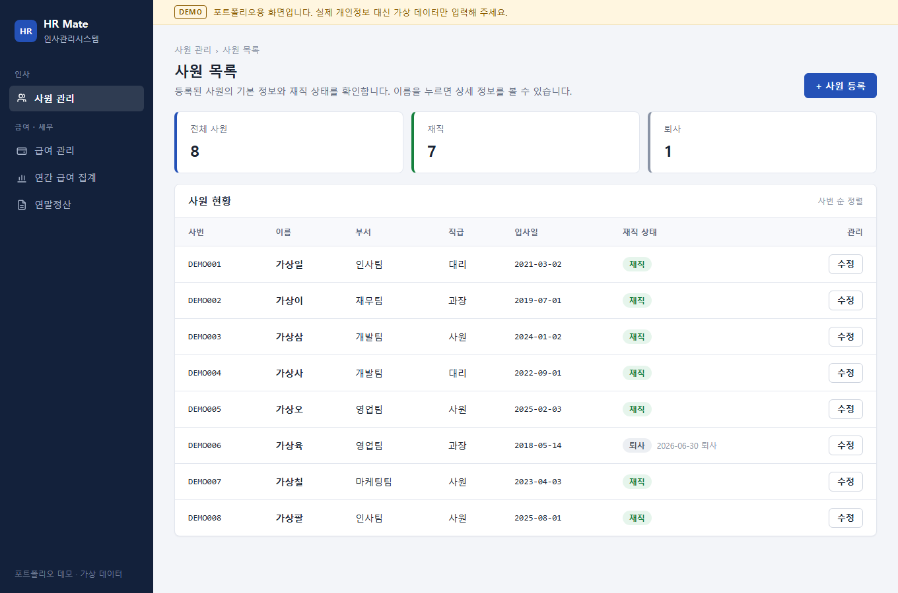
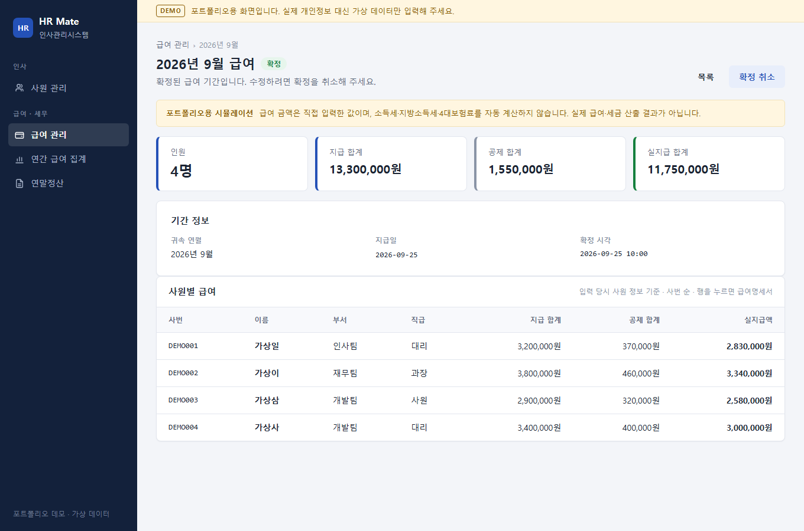
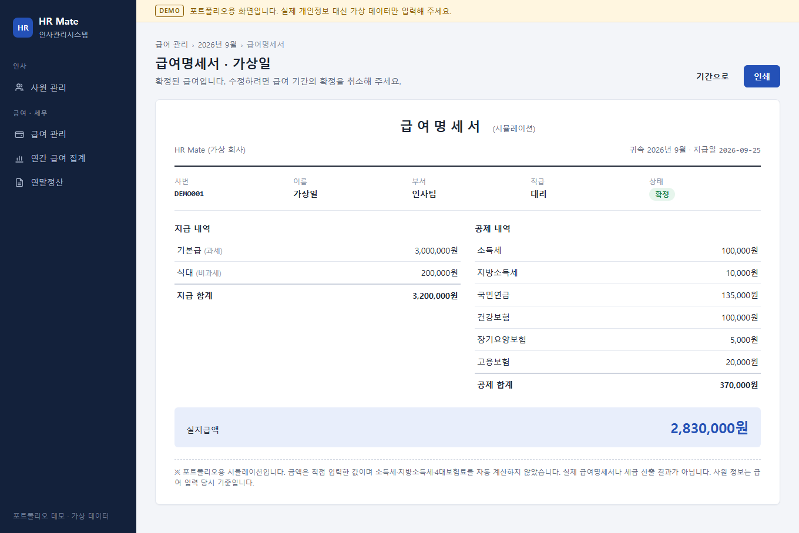
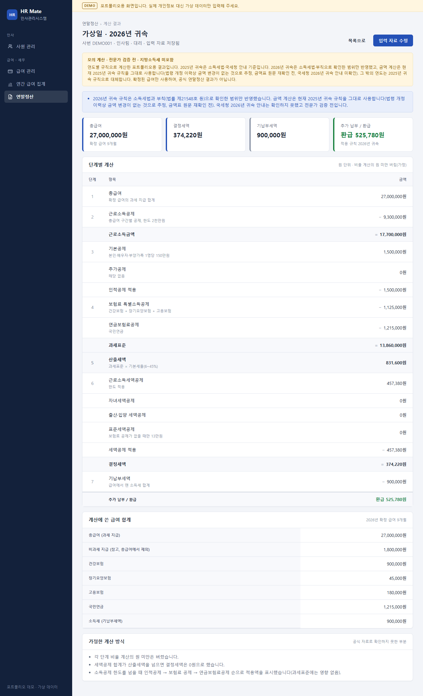

# HR Mate

인사팀 업무를 돕는 **인사·급여 관리 웹서비스** 포트폴리오 프로젝트입니다. (React + Spring Boot + MariaDB)

- 사원 정보 등록·조회·수정, 퇴사 처리, 논리 삭제
- 월별 급여 입력·확정과 급여명세서 보기·인쇄, 귀속 연도 기준 연간 급여 집계
- 확정 급여를 바탕으로 한 연말정산 **모의 계산** (단계별 계산표, 경고와 가정 표시)

> **고지 사항**
> - **가상의 직원 데이터만** 사용합니다. 실제 개인정보를 입력하지 마세요.
> - 실제 급여 지급이나 세무 신고에 사용할 수 있는 **공식 시스템이 아닙니다.** 급여·연말정산 결과는 **시뮬레이션(포트폴리오용) 결과**입니다.
> - 연말정산은 연도별 규칙으로 계산한 **모의 계산**입니다. 2025년 귀속은 소득세법·국세청 안내 조사 기준입니다. 2026년 귀속은 소득세법·부칙으로 확인한 범위만 반영했고, 금액 계산은 현재 2025년 귀속 규칙을 그대로 사용합니다(법령 개정 이력상 금액 변경이 없는 것으로 추정, 금액표 원문 재확인 전, 국세청 2026년 귀속 안내 미확인). 그 밖의 연도는 2025년 귀속 규칙으로 대체합니다. 전문가 검증 전이며, 지방소득세는 포함하지 않고, 일부 계산 방식은 가정입니다. 공식 연말정산 결과가 아닙니다.

## 화면

> 아래 화면은 **가상 데이터와 가짜 API 응답으로 촬영한 포트폴리오용 시뮬레이션**입니다. 실제 직원 정보가 아니며, 화면의 급여·세금 금액은 **실제 급여나 세금 산출 결과가 아닙니다.**

**사원 목록** — 전체·재직·퇴사 요약 카드와 사원 현황 표입니다. 이름을 누르면 상세 화면으로 이동합니다.



**급여 기간 상세 (확정)** — 2026년 9월 급여 기간의 인원·지급·공제·실지급 합계와 사원별 급여입니다. 확정된 기간은 확정을 취소해야 수정할 수 있습니다.



**급여명세서** — 지급·공제 내역과 실지급액, 인쇄 버튼입니다. 금액은 직접 입력한 시뮬레이션 값이며 소득세·지방소득세·4대보험료를 자동 계산하지 않습니다.



**연말정산 모의 계산 결과 (2026년 귀속)** — 모의 계산 고지, 2026년 귀속 확인 상태 안내, 요약 카드, 7단계 계산표, 계산에 쓴 급여 합계, 가정한 계산 방식입니다. 본인 기본공제만 입력한 가상 사례이며 공식 연말정산 결과가 아닙니다. 세로로 긴 이미지라 접어 두었습니다.

<details>
<summary>연말정산 결과 화면 펼치기 (이미지를 누르면 원본 크기 1360×2235)</summary>



</details>

## 주요 기능

| 기능 | 내용 |
|---|---|
| 사원 관리 | 등록(사번 중복 확인), 목록(요약 카드·재직 상태), 상세, 수정, 퇴사 처리, 논리 삭제(삭제한 사번은 재사용 불가) |
| 월별 급여 | 급여 기간 만들기, 사원별 급여 입력·수정·삭제, 기간 확정·확정 취소, 급여명세서 보기·인쇄. 세금·보험료는 직접 입력한 값이며 자동 계산하지 않음 |
| 연간 급여 집계 | 귀속 연도 기준, 확정된 기간만 합산, 사원별 월별 내역 |
| 연말정산 모의 계산 | 사원·연도별 입력 자료(인원 수·해당 여부만, 개인 식별 정보 없음)와 확정 급여 합계로 근로소득공제·인적공제·보험료/연금보험료 공제·기본세율·근로소득/자녀/표준세액공제를 계산하고 추가 납부/환급 표시. 연도별 규칙(2025·2026년 귀속 등록, 그 밖의 연도는 2025년 규칙으로 대체하고 경고), 자녀세액공제 연령은 계산에 쓰지 않고 연도별 안내만 표시(2017년생 주의 문구 포함) |

- 추후 후보: 이번 범위에서 제외한 공제(신용카드·의료비·교육비·기부금·월세 등), 지방소득세, 2027년 이후 귀속 규칙, 2026년 귀속 금액표 원문·국세청 안내 확인
- 단계별 개발 기록: [docs/progress.md](docs/progress.md)

## 기술 스택

| 구분 | 기술 |
|---|---|
| 프론트엔드 | React 19, React Router 7, Vite 8, oxlint |
| 백엔드 | Spring Boot 4.1 (Java 17, Gradle), Spring Data JPA, Flyway |
| 데이터베이스 | MariaDB 11.8 |

## 구조

```
브라우저 ─ React 화면 (Vite 개발 서버 :5173)
             │  /api 요청은 Vite 프록시가 전달
             ▼
         Spring Boot API (:8080) ─ MariaDB
```

- 테이블(Flyway 마이그레이션 V1~V3): 사원(`employee`), 급여 항목·기간·급여·급여 내역(`pay_item`, `payroll_period`, `payroll`, `payroll_line`), 연말정산 입력 자료(`year_end_input`). 연말정산 계산 결과는 저장하지 않고 조회할 때마다 계산합니다.

```
HR-Mate/
├─ README.md
├─ CLAUDE.md            AI 코딩 도구(Claude Code) 작업 지침
├─ .claude/             AI 코딩 도구 프로젝트 권한 제한 설정
├─ docs/                요구사항, API 명세, 세법 조사, 데모 가이드, 진행 기록, 화면 캡처
├─ backend/             Spring Boot 서버 (employee·payroll·yearend 패키지)
└─ frontend/            React 화면 (안내: frontend/README.md)
```

## 실행 방법

Windows PowerShell 기준입니다. macOS·Linux에서는 `.\gradlew.bat` 대신 `./gradlew`를 사용합니다.

**준비물:** JDK 17, Node.js(Vite 8 요구 사항: 20.19 이상 또는 22.12 이상, 개발 환경은 Node.js 24), MariaDB

> 아래 명령의 `C:\work\HR-Mate`는 예시 경로입니다. 저장소를 받은 실제 폴더 경로로 바꿔 입력하세요.

### 1. 데이터베이스 준비 (처음 한 번)

[docs/setup-database.md](docs/setup-database.md)대로 개발용 DB와 앱 전용 계정을 만듭니다. 테이블은 백엔드를 처음 실행할 때 Flyway가 만듭니다.

### 2. 백엔드 (터미널 1)

1. 로컬 설정 예시 파일을 복사합니다. (처음 한 번)

   ```powershell
   cd C:\work\HR-Mate
   Copy-Item backend\src\main\resources\application-local.yml.example backend\src\main\resources\application-local.yml
   ```

2. 복사한 `application-local.yml`을 편집기로 열어 앱 계정 비밀번호를 직접 입력하고 저장합니다.
   이 파일은 Git에서 제외됩니다. 비밀번호를 채팅이나 다른 파일에 적지 않습니다.

3. 서버를 실행합니다. 로그에 `Started HrMateApplication`이 나오면 성공입니다. 종료는 `Ctrl + C`.

   ```powershell
   cd C:\work\HR-Mate\backend
   .\gradlew.bat bootRun
   ```

### 3. 프론트엔드 (터미널 2)

```powershell
cd C:\work\HR-Mate\frontend
npm install
npm run dev
```

브라우저에서 http://localhost:5173 을 엽니다. (`npm install`은 처음 한 번만)

- 등록·수정·삭제한 내용은 로컬 개발 DB에 저장됩니다. 가상 데이터만 입력하세요.
- 백엔드가 꺼져 있으면 화면에 "서버에 연결할 수 없습니다" 안내가 나옵니다.

### 백엔드 다시 켜기

백엔드는 **켤 때의 코드로 계속 동작**합니다. 코드를 받거나 바꾼 뒤에는 한 번 끄고 다시 켜야 새 기능이 반영됩니다.

1. 백엔드 터미널에서 `Ctrl + C` (`일괄 작업을 끝내시겠습니까 (Y/N)?`가 나오면 `Y`)
2. 8080 포트가 비었는지 확인합니다. `0`이면 꺼진 것입니다.

   ```powershell
   @(Get-NetTCPConnection -LocalPort 8080 -State Listen -ErrorAction SilentlyContinue).Count
   ```

3. `1`이면 Gradle 데몬(백그라운드 도우미) 아래에 남아 있는 것입니다. `backend` 폴더에서 `.\gradlew.bat --stop` 후 2번을 다시 확인합니다.
4. `.\gradlew.bat bootRun`으로 다시 실행합니다. 새 마이그레이션이 없으면 DB 데이터는 바뀌지 않습니다.

## 데모 데이터와 시연

- 시연용 가상 사원 12명(재직 10, 퇴사 2): [docs/sample-data/sample-employees.sql](docs/sample-data/sample-employees.sql). 모든 인물·연락처는 가상이며, 이메일은 `example.com`만 쓰고 전화번호는 비워 둡니다.
- 추가(INSERT)만 하며 여러 번 실행해도 중복되지 않습니다. 한 번 넣은 데이터는 되돌리기 어려우니 내용을 확인한 뒤 실행하세요.
- 넣는 방법과 사원·급여·연간 집계·연말정산 시연 순서: [docs/demo-guide.md](docs/demo-guide.md)

## 테스트

- 백엔드 테스트는 개발 DB가 아닌 **테스트 전용 DB**에만 연결합니다. 테스트용 설정이 없거나 틀리면 DB 테스트가 실패하며, 개발 DB로 대신 연결하지 않습니다.
- 처음 한 번 [docs/setup-test-database.md](docs/setup-test-database.md)대로 테스트 전용 DB·계정과 테스트용 로컬 설정 파일을 준비합니다.
- 2026-09-29 기준 백엔드 테스트 265개(계산 규칙 단위 테스트, 서비스·컨트롤러 테스트, 저장소·마이그레이션 제약 테스트, API 통합 테스트).

```powershell
cd C:\work\HR-Mate\backend
.\gradlew.bat test
```

프론트엔드는 `npm run lint`와 `npm run build`로 검사합니다.

## 문서

| 구분 | 문서 |
|---|---|
| 요구사항 | [1차 사원 관리](docs/requirements-mvp1.md), [급여(2·3차)](docs/requirements-payroll.md), [연말정산(4차)](docs/requirements-year-end.md) |
| API 명세 | [사원 API](docs/api/employee-api.md), [급여 API](docs/api/payroll-api.md), [연말정산 API](docs/api/year-end-api.md) |
| 세법 조사 | [근로소득 귀속연도](docs/tax-rules/income-attribution.md), [연말정산 2025년 귀속](docs/tax-rules/year-end-settlement-2025.md), [연말정산 2026년 귀속 보강](docs/tax-rules/year-end-settlement-2026.md) |
| 설정·시연 | [개발 DB 설정](docs/setup-database.md), [테스트 DB 설정](docs/setup-test-database.md), [데모 가이드](docs/demo-guide.md) |
| 진행 기록 | [docs/progress.md](docs/progress.md) |

## AI 도구 사용

- 이 프로젝트는 AI 코딩 도구 **Claude Code**의 도움을 받아 개발했습니다. 커밋 메시지의 `Co-Authored-By: Claude` 표기가 이를 나타냅니다.
- [CLAUDE.md](CLAUDE.md)는 AI 코딩 도구가 이 저장소에서 작업할 때 따르는 지침입니다.
- `.claude/settings.json`은 AI 코딩 도구의 **프로젝트 권한 제한 설정**입니다. 비밀번호가 들어가는 로컬 설정 파일과 `.env` 파일을 읽거나 고치지 못하게 막으며, 비밀 값은 들어 있지 않습니다.

## 라이선스

이 저장소에는 별도의 오픈소스 라이선스를 부여하지 않았습니다. 포트폴리오 열람을 위해 공개하며, 저작권법상 허용되는 범위를 넘어 코드를 복제·수정·재배포할 수 있는 권한은 부여하지 않습니다. 인용한 법령·공공기관 자료의 권리는 각 원저작자에게 있습니다.
